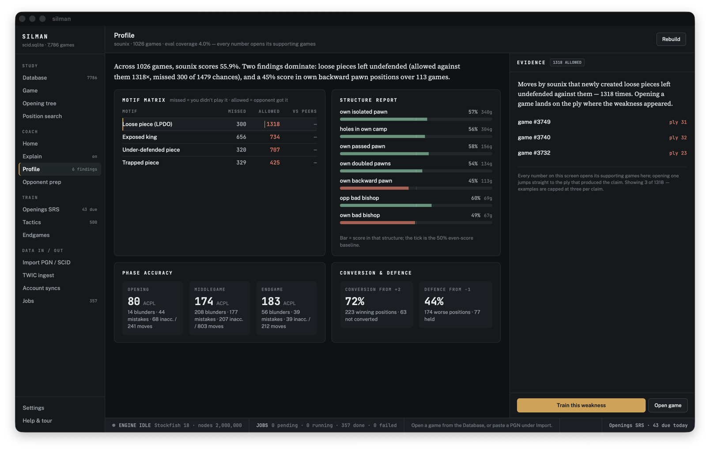
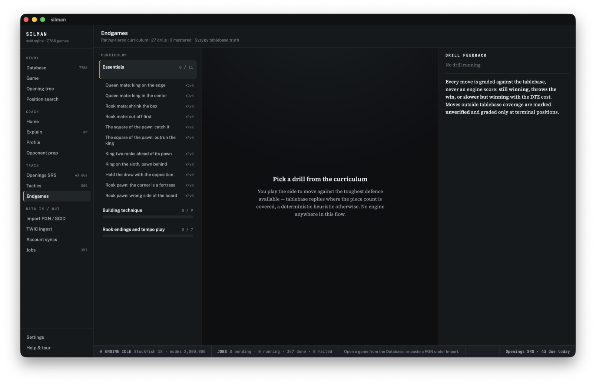
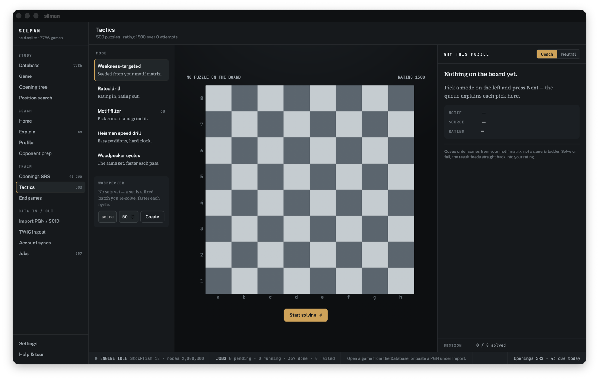

# Kibitz

**A chess coach and database that explains positions in human terms.**

Most chess software will tell you that a move is −1.3. Kibitz tells you *why*:
which imbalances define the position, whose plan is faster, which piece is
loose, and what you keep getting wrong across your own games — then trains you
on exactly those weaknesses.

Kibitz is a free, open-source desktop app (macOS and Linux). Project site:
[kibitzchess.org](https://kibitzchess.org) — including the rendered
[user guide](https://kibitzchess.org/guide.html). It is built around three
ideas:

1. **Explain, don't just evaluate.** A static explanation engine reads the
   position the way a teacher would — material, pawn structure, king safety,
   piece activity, files and diagonals, space, development — and renders the
   verdict as prose with evidence you can click. The teaching style is inspired
   by Jeremy Silman's imbalance framework.
2. **Train on *your* games.** Kibitz profiles your imported games (motif matrix,
   structure report, phase accuracy, conversion/defence) and feeds the findings
   straight into its trainers. Every claim links to the exact ply in the exact
   game that produced it.
3. **The engine stays off by default.** Stockfish runs only when a tactical
   screen says the position is sharp, when you explicitly ask, or in batch jobs
   you start yourself. Quiet positions get quiet, human answers.

## Screenshots

*Taken from a pre-release build; the window still shows the project's working
title in place of "Kibitz".*

**Profile — every number is a claim, every claim opens the game that produced it:**



**Endgame trainer — moves graded against Syzygy tablebases, never an engine score:**



**Tactics — weakness-targeted, rated, Woodpecker cycles, speed drills:**



## Features

**Coach**

- Static explanations of any position: imbalances, plans, tactical alerts, in a
  coach or neutral voice — offline, no engine, no network.
- Delta narration: what the last move actually changed.
- Player profile built from your own games: motif matrix (missed vs. allowed),
  structure scores, phase accuracy (ACPL), conversion and defence rates — with
  click-through evidence to the source ply.
- Opponent prep: fingerprint an opponent's games, find the weak lines, and turn
  them into a prep sheet.

**Train**

- Repertoire trainer: per-color opening repertoires scheduled with FSRS-4.5
  spaced repetition.
- Tactics trainer: rated puzzles from the Lichess puzzle database (CC0),
  weakness-weighted from your profile, plus motif filters, Woodpecker cycles,
  and speed drills.
- Endgame trainer: a rating-tiered curriculum where every move is graded
  against Syzygy tablebases — *still winning*, *slower (with the DTZ cost)*, or
  *throws the win* — never a bare engine number.

**Database**

- SQLite-backed personal database with import from **SCID (.si4)** and **PGN**;
  PGN export for round-tripping.
- TWIC ingest (downloads to your machine — TWIC data is never bundled).
- Lichess and chess.com account sync, FICS archives.
- Opening tree with ECO names, position search, duplicate detection with
  source-aware precedence.
- Batch annotate/analyze through a job queue — resumable, pausable, with honest
  time estimates.

## Install

Download the latest release for your platform from
[GitHub Releases](https://github.com/avienu/kibitz/releases).

- **macOS**: download the `.dmg`, drag Kibitz to Applications.
- **Linux**: download the `.AppImage` (make it executable) or the `.deb`.

To use engine analysis, point Kibitz at a
[Stockfish](https://stockfishchess.org/) binary in **Settings → Engine** (or
leave the path empty to let Kibitz resolve one automatically). For
tablebase-verified endgame training, point Settings at a local
[Syzygy](https://syzygy-tables.info/) tablebase directory. Both are optional —
everything else works offline out of the box.

## Building from source

Prerequisites:

- **Rust** stable, 1.82 or newer ([rustup](https://rustup.rs/))
- **Node.js** 22 or newer, with npm
- **Linux only**: Tauri's system libraries —
  `libwebkit2gtk-4.1-dev build-essential curl wget file libxdo-dev libssl-dev
  libayatana-appindicator3-dev librsvg2-dev`

```sh
git clone https://github.com/avienu/kibitz.git
cd kibitz

# Core crates + database layer
cargo test --workspace

# Front end
cd app
npm install
npm test

# Run the desktop app in dev mode
npm run tauri dev

# Or produce a release bundle (app/src-tauri/target/release/bundle/)
npm run tauri build
```

## Bringing your games in

- **SCID**: open **Import PGN / SCID** and point it at a `.si4` database; games,
  names, and headers import directly.
- **PGN**: import any `.pgn` file, or paste PGN straight into the import view.
- **ChessBase**: native ChessBase formats are out of scope — export your
  database to PGN in ChessBase, then import the PGN.
- **Online play**: connect your Lichess and chess.com accounts under
  **Account syncs**; ingest TWIC issues under **TWIC ingest**.

Every imported dataset's provenance (source, license, date) is tracked in the
database.

## License

Kibitz is split by design into two license layers:

- **`crates/*`** (explanation engine, profiling, SRS scheduling, tablebase
  probing, SCID reading) — **BSD-3-Clause**. These crates are free of GPL
  dependencies, enforced by a CI license gate.
- **`app/`** (the Tauri desktop app and its database layer) — **GPL-3.0**.

See [LICENSE-BSD](LICENSE-BSD), [LICENSE-GPL](LICENSE-GPL), the per-crate
LICENSE files, the dependency registry in [docs/LICENSES.md](docs/LICENSES.md),
and [THIRD-PARTY-NOTICES.md](THIRD-PARTY-NOTICES.md).

## Acknowledgments

- **Jeremy Silman** (1954–2023), whose imbalance-based teaching in *How to
  Reassess Your Chess* inspired the explanation engine's approach. Kibitz is not
  affiliated with or endorsed by his estate.
- **[Stockfish](https://stockfishchess.org/)** (GPL-3.0), run as a separate
  user-provided process for tactical screening and analysis.
- **[Lichess](https://lichess.org/)** for the CC0 puzzle database and openings
  dataset.
- **[Fathom](https://github.com/jdart1/Fathom)** (MIT) for Syzygy tablebase
  probing, vendored in `crates/kibitz-tb`.
- **[chessground](https://github.com/lichess-org/chessground)** (GPL-3.0) for
  the board UI, and Colin M.L. Burnett's classic **cburnett** piece set bundled
  with it.
- **[cozy-chess](https://github.com/analog-hors/cozy-chess)** (MIT) for board
  representation and move generation.
